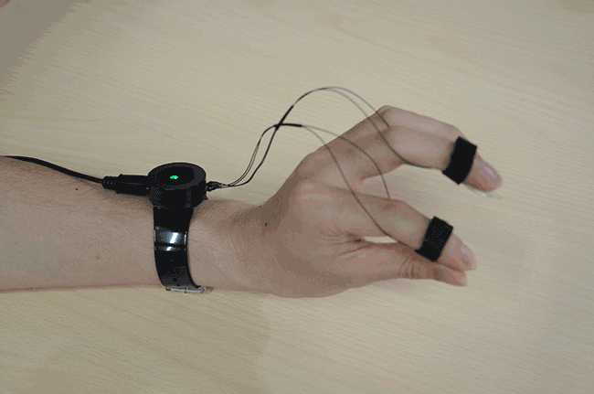

##DOHAMARI Finger Synthesizer Wrist Device

##Body

- base A (Acrylic 2mm)
- middle (Acrylic 5mm)
- base B (Acrylic 2mm)
- top (Clear Acrylic 2mm)
- Strap Holder (Acrylic 2mm)

##Finger Sensor

- Electrodes
- Strap
- Cover (PET 0.5mm)
- Wire

##Electronic Parts

- Pololu A-Star 32U4 Micro x 1 [https://www.pololu.com/product/3101](https://www.pololu.com/product/3101)
- 10kΩ Carbon Resistor x 2
- Surface Mount Transistors x 2
- Full Color LED Module Adafruit_NeoPixel x 1

##Schematics

